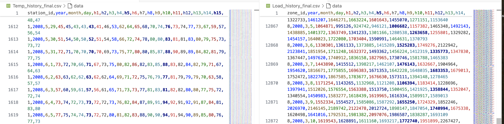
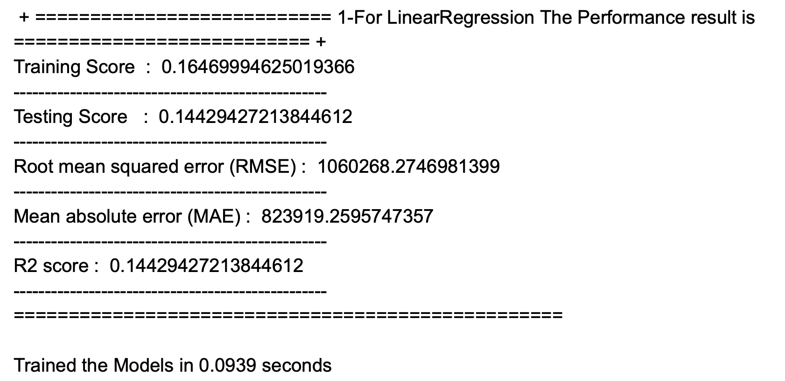
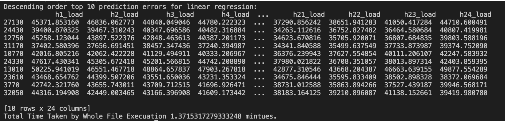
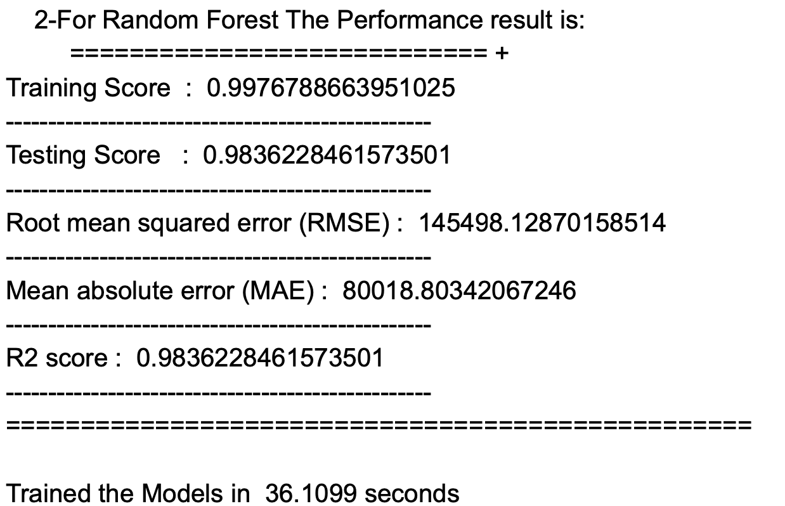
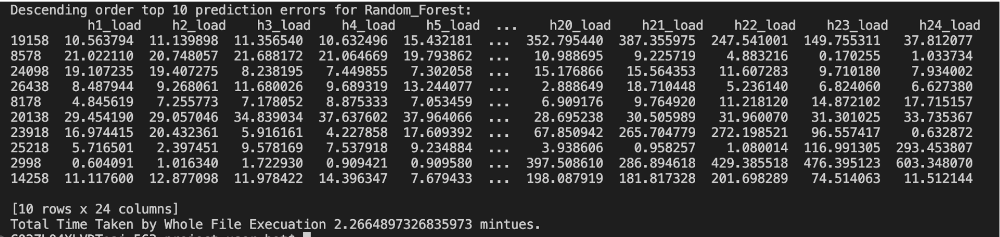
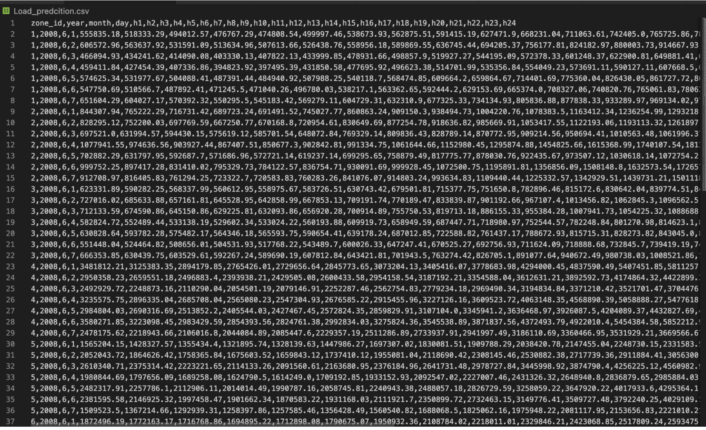
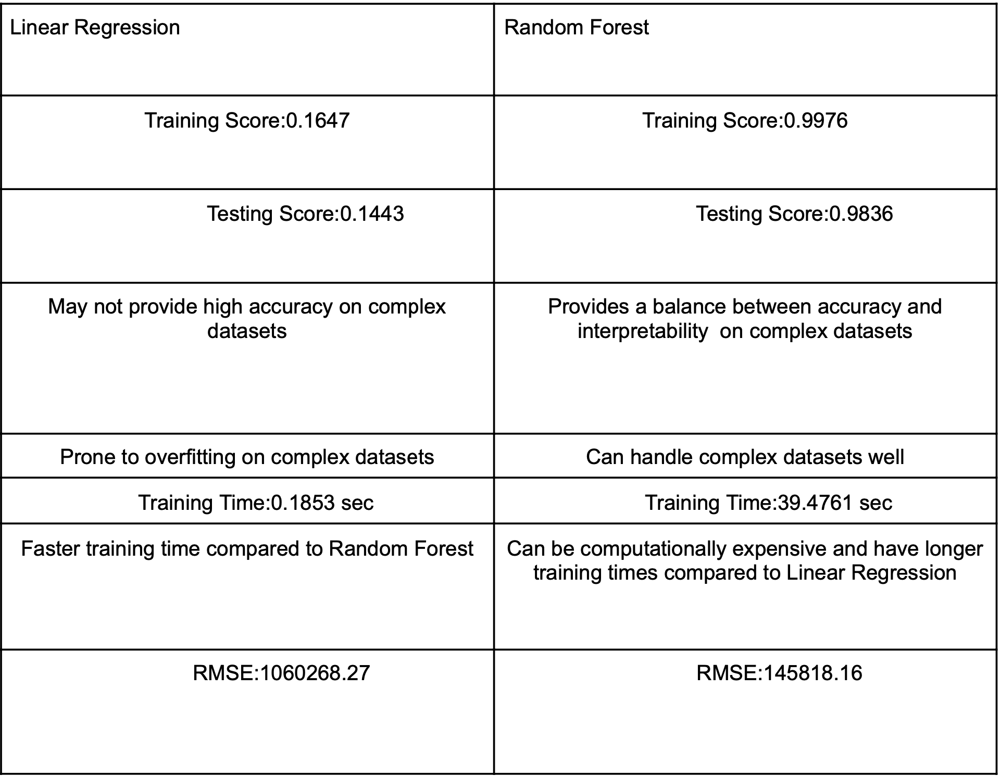

# Hourly Load Forecasting
## A Comparative Evaluation of Machine Learning Models Across 20 US Zones
This project uses temperature and historical load data from 11 stations to predict hourly load values across 20 US zones for the week of June 1-7, 2008. Data preprocessing includes outlier removal and feature engineering. I map temperature stations to load zones based on their correlation to optimize predictions. Two machine learning algorithms, linear regression and a more complex random forest model, are evaluated and tuned on training and validation datasets. The models' performances are compared in terms of speed and accuracy, with the best-performing model selected for final predictions. Results from both models are systematically compared to determine effectiveness.
## Training Data(11 temperature_Station and 20 Load_zones)

## Data Preprocessing and Mapping

Project involves cleaning the data and establishing a significant correlation between temperature stations and load zones. The data is sourced from two CSV files: one containing temperature readings and the other load data from various utility companies across the US.
1. **Data Loading**: Data is loaded into NumPy dataframes, facilitating faster operations and easier handling.
2. **Correlation Analysis**: I calculate correlation coefficients to identify strong links between specific temperature stations and load zones. This analysis helps in pinpointing which stations influence particular load zones the most.
3. **Data Cleaning**:
   - **Outlier Removal**: Using statistical methods, outliers are identified and removed to ensure the model's accuracy.
   - **Feature Engineering**: New features are created based on statistical properties (like min, max, average, std, and variance per day) to enrich the model's input data.

```python
import pandas as pd
import numpy as np
import seaborn as sns
import matplotlib.pyplot as plt

# Load and preview data
df_temp = pd.read_csv("Temp_history_final.csv")
df_load = pd.read_csv("Load_history_final.csv")

# Correlation analysis
corr_data = []
for station in df_temp.station_id.unique():
    for zone in df_load.zone_id.unique():
        temp_data = df_temp[df_temp.station_id == station]
        zone_data = df_load[df_load.zone_id == zone]
        correlation = temp_data.corrwith(zone_data).round(3)
        corr_data.append((station, zone, correlation))

# Data preprocessing
df_combined = pd.merge(df_temp, df_load, on=["year", "month", "day"])
df_combined.drop(columns=['station_id', 'zone_id'], inplace=True)
......
.......
........
```

### Heatmap Analysis

The heatmap visualizes the correlation between average temperatures from 11 stations and load data across 20 zones. Darker green shades indicate stronger correlations, while darker purples show weaker ones. Each cell shows the correlation coefficient rounded to two decimal places. Notably, stations 4 and 8 exhibit a strong negative correlation with zone 11, suggesting that higher temperatures at these stations lead to lower load demands in that zone. This insight is crucial for selecting the most predictive temperature stations for forecasting load values in specific zones.


# Linear Regression Model:

### Procedure

The process for developing first machine learning model, the Linear Regression, involved several stages:

1. **Data Loading and Preparation**: Data from load zone and temperature station CSV files is loaded into Pandas dataframes. The station with the strongest correlation (station 8) to the load zones is identified for feature selection.
2. **Feature Selection and Engineering**: Features including zone ID, year, month, day, temperature, load values, and statistical measures (min, max, average, std, variance) are derived from the correlation analysis.
3. **Data Cleaning**: Outliers are removed using percentiles and interquartile range methods, with outlier data points replaced by NaN. Rows with NaN values are subsequently dropped.
4. **Data Splitting**: The dataset is divided into training (70%) and testing (30%) sets.
5. **Model Training and Hyperparameter Tuning**: The Linear Regression model is trained. Given the nature of this model, there are limited hyperparameters available for tuning.
6. **Performance Evaluation**: The model is evaluated using metrics such as RMSE (Root Mean Squared Error), MAE (Mean Absolute Error), and R-squared scores.

## Model Hyperparameters and Performance

### Hyperparameters

For our Linear Regression model, I considered the following hyperparameters:

- `fit_intercept`: [True, False] - Specifies if a constant should be added to the decision function.
- `positive`: [True, False] - Enforces the coefficients to be positive.
- `cv`: 2 - Cross-validation splitting strategy.
- `random_state`: 42 - Ensures reproducibility across multiple function calls.

### Hyperparameter Tuning with GridSearchCV and Model Evaluation

Even though Linear Regression typically involves fewer hyperparameters, I employed `GridSearchCV` to systematically explore combinations and determine the optimal settings:

```python
from sklearn.model_selection import GridSearchCV
from sklearn.linear_model import LinearRegression

# Setup GridSearchCV
params = {
    "fit_intercept": [True, False],
    "positive": [True, False]
}
lr_grid_search = GridSearchCV(estimator=LinearRegression(), param_grid=params, cv=2)

# Fit GridSearchCV
lr_grid_search.fit(X_train, y_train)
print(f"Best Parameters {lr_grid_search.best_params_}")
```

### Output Score

The performance results for the Linear Regression model are as follows:


### Observations

The performance of the Linear Regression model was found to be suboptimal:

- **Training Score**: 0.16
- **Testing Score**: 0.14
- **RMSE**: 1,060,268.27
- **MAE**: 823,919.26
- **R2 Score**: 0.14

These metrics suggest that the model does not fit the data well. Despite tuning hyperparameters, the low R2 score indicates poor predictive accuracy. Various strategies such as feature reduction, regularization to prevent overfitting, and employing more complex models like Decision Trees or Support Vector Machines might improve results. Further exploration using techniques like GridSearchCV or RandomizedSearchCV, selecting different feature sets, or engineering new features could also enhance model performance.

### Trade-offs

- **Simplicity vs. Accuracy**: Linear Regression is chosen for its straightforwardness and interpretability. However, its simplicity may come at the cost of accuracy, particularly in complex datasets where the relationship between variables isn't purely linear.
- **Overfitting**: Care is taken to avoid overfitting by selecting appropriate features and tuning the model's hyperparameters. Overfitting occurs when a model learns the training data too well, including the noise and outliers, which can degrade its performance on unseen data.
- **Assumption of Linearity**: Linear regression assumes a linear relationship between the independent and dependent variables. If this assumption does not hold, the model's effectiveness decreases, prompting the exploration of more complex models.

Despite these considerations, linear regression provides a solid foundation for understanding relationships within the data and serves as a benchmark for more sophisticated models.

## Top 10 prediction errors for linear regression based on the examples



# Second model(Strong model)

## Random Forest Regressor Model: Implementation and Evaluation

### Data Preparation and Splitting

The dataset preparation for the Random Forest model follows the same initial steps as the Linear Regression model, ensuring consistency in how the data is treated across different models. The significant step involves splitting the data into training and testing sets to validate the model's performance effectively:

```python
from sklearn.model_selection import train_test_split

# Splitting data into training and testing
X_train, X_test, y_train, y_test = train_test_split(X, y, test_size=0.30, random_state=42)
```

- This configuration sets aside 30% of the data for testing, which helps in evaluating the model's generalization to new, unseen data.

### Model Training with Default Settings

The Random Forest Regressor is implemented using default parameters to establish a baseline for its performance. This approach allows for assessing the effectiveness of the model without initial customization.
### Inputs: Default Hyperparameters

The Random Forest Regressor was configured with the following default hyperparameters, chosen to provide a robust baseline without initial customization:

- n_estimators: 100 // Number of trees in the forest
- criterion: 'mse' // Function to measure the quality of a split
- max_depth: None // Maximum depth of the tree
- min_samples_split: 2 // Minimum number of samples required to split an internal node
- min_samples_leaf: 1 // Minimum number of samples required to be at a leaf node
- min_weight_fraction_leaf: 0 // Minimum weighted fraction of the sum total of weights required to be at a leaf node
- max_features: 'auto' // The number of features to consider when looking for the best split
- max_leaf_nodes: None // Maximum number of terminal nodes
- random_state: 42 // Ensures reproducibility
  

  ## Top 10 prediction errors for Random Forest based on the examples

  
  
  The table below shows the top 10 prediction errors in descending order, highlighting the
magnitude of the relative percentage error (| 100*(Ytrue - Ypred)/Ytrue |). The errors are not
significantly large, which indicates the model is performing well.

### Random Forest prediction that contains all 20zones load values for June 1-7, 2008



### Machine Learning Model Comparison

I employed two supervised machine learning algorithms:

- **Linear Regression**: This model showed limited success, characterized by low R2 scores and high error rates. Despite efforts at hyperparameter tuning and various enhancements, it struggled to accurately predict load values, suggesting its limitations for complex datasets.
- **Random Forest**: Contrarily, the Random Forest model delivered strong performance using default settings. It struck an effective balance between accuracy and interpretability, confirming its appropriateness for this analytical task without needing extensive tuning.
- ## Table summarizing your comparison of the two different ML models.


### Key Insights

The project underscored the importance of selecting appropriate machine learning models based on the dataset and the analytical requirements. It demonstrated the necessity of balancing several critical factors:

- **Accuracy and Interpretability**: Ensuring the model is understandable while maintaining high accuracy.
- **Overfitting and Generalization**: Avoiding overfitting to ensure the model performs well on new, unseen data.
- **Training Duration and Prediction Speed**: Managing the computational demands of the model relative to its performance.
- **Bias-Variance Trade-off**: Striking the right balance to optimize model predictions.

## Project Conclusion
This project aimed to predict hourly load values for a Ist week in June 2008 across 20 different load zones in the US, leveraging data from 11 temperature stations and historical load records. Through comprehensive data preprocessing including outlier removal, data merging, and feature engineering,I prepared a robust dataset for modeling.
Ultimately, the Random Forest model emerged as the more suitable option for predicting load values in this context, showcasing its robustness and efficiency. This project highlights the potential of Random Forest as a powerful tool for load forecasting in the energy sector, capable of providing reliable and accurate predictions.
